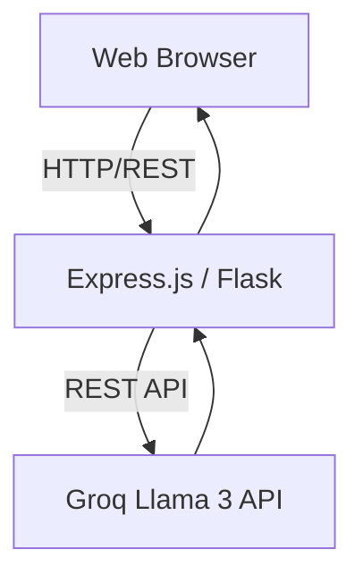

# PolyTalk AI - Technical Architecture

## High Level Overview

PolyTalk AI uses a dual-backend MVC architecture, supporting both a Python/Flask implementation (designed for local developer environments) and a Node.js/Express/Vite backend (designed for containerized production environments like Google AI Studio, Docker, or Cloud Run).

## Frontend (Static Assets)
The frontend uses 100% Vanilla HTML, CSS, and JS.
- No React/Vue/Angular overhead.
- Features real-time Markdown parsing.
- Uses Web Speech APIs (Synthesis and Recognition) mapping voices to OS-level language packs.
- The UI is styled with utility-first approaches via Tailwind CSS logic (handled via CDN).
- Glassmorphism is heavily used for the aesthetic layout.

## Backend (Dual Implementation)

### 1. Node.js (Production)
- Handled by `server.ts`.
- Uses Express.js to expose the `/chat` route.
- Serves Vite statically built assets.
- Hardened with sliding window rate limiting, XSS sanitization, and anti-prompt-injection mechanisms.

### 2. Python (Development)
- Handled by `app.py`.
- Uses Flask.
- Modularized via `chatbot/` containing persona logic, Groq integration, and language classification.
- Automatically captures current OS datetime for injecting context to LLM.

## AI Infrastructure
- **Model**: `llama-3.1-8b-instant` via Groq.
- **Parsing**: Because the model occasionally prepends text to JSON formats, the backend ignores native Groq JSON mode and performs Regex Extraction to strip `\{\}` blocks.
- **Safety**: Prompt injection filters run synchronously before API transmission.
